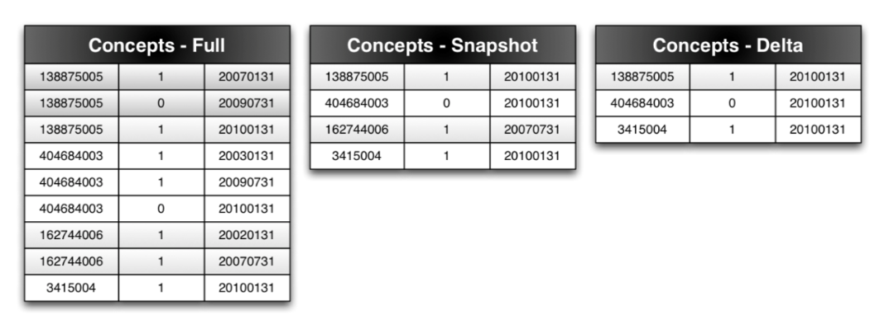
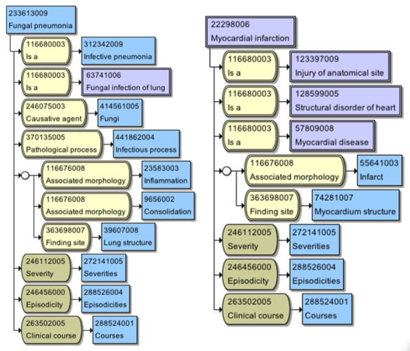
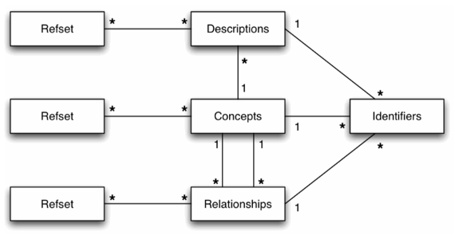
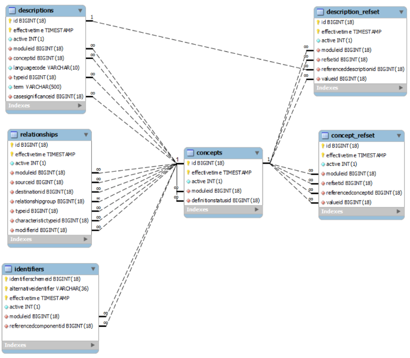
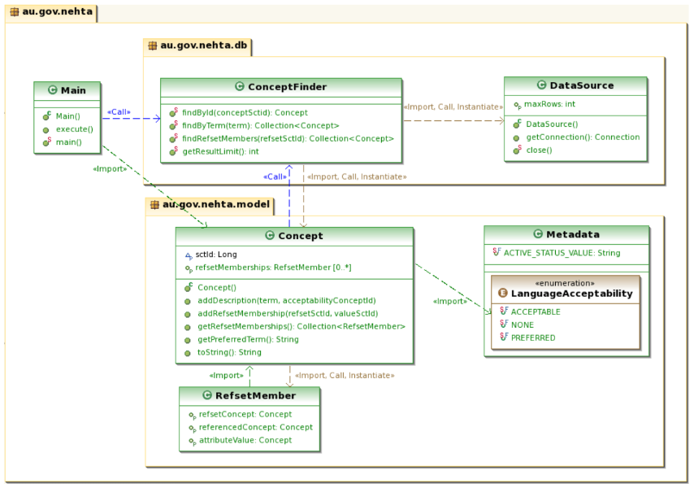
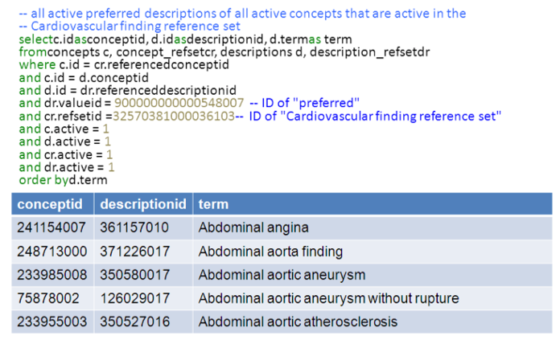

# SNOMED CT-AU Refset Sample Application

# Purpose
This document provides an overview of the general functionality and intent of the two applications in this repository which aim to provide developers with an understanding of RF2 files.

The techniques and code used in this repository ***are NOT*** recommended as a method of implementing SNOMED CT-AU, a terminology server and/or a bespoke data structure for the particular requirements should be used instead. Detail knowledge of the release format described by these scripts and the implementation guide are required to build, but *not* when using an appropriate terminology server, which will abstract these details away and typically provide much more relevant search functionality and algorithms.

The National Clinical Terminology Service provides an HL7 FHIR terminology service endpoint containing up to date terminologies for Australia, the [National Terminology Server](https://www.healthterminologies.gov.au/tools?content=nts). The NCTS also makes the terminology server software available at this endpoint free for use in Australian health care which can synchronise in content from the NCTS and be augmented with additional FHIR terminology resources as required. [More details on this refer to the NCTS website](https://www.healthterminologies.gov.au/tools?content=onto).

Vendors and implementers in Australia are encouraged to use these services where possible to avoid the duplicated effort of implementing the details described by these scripts and insulate themselves from possible future change to them.

# Functions demonstrated
Both Java and .NET versions of the sample application demonstrate querying the data through the following simple functionality:
1. Display the details of a concept. The SNOMED CT identification number SNOMED CT-AU and the active descriptions (or “terms”) are retrieved.
2. Identify the Australian Dialect (en-AU) acceptability of a description, being either “preferred” or “acceptable”, by looking up the description in the Australian Dialect Reference Set (ADRS).
3. Specify all the Clinical and Foundation reference sets that a concept is an active member of.
4. Specify all the concepts that are active members of a specific Clinical or Foundation reference set.

The application provides the following operations for retrieving concepts:
1. Find a single concept by its SNOMED CT identifier.
2. Find concepts with an active description containing a textual search term.
3. List all the members of reference set by providing the SNOMED CT identifier of the reference set.

# Questions, feedback and contributions
Questions, feedback and contributions are most welcome.

The best way to provide feedback or make contributions is by creating an issue on the project, or creating a pull request. For more details on how to contribute read the [CONTRIBUTING](../CONTRIBUTING.md) file.

Any feedback not appropriate for an issue or a pull request is also welcome. Please send an email to [help@digitalhealth.gov.au](mailto:help@digitalhealth.gov.au).

# SNOMED CT-AU overview
This section provides a summary. More details can be found in the [SNOMED CT-AU Technical Implementation Guide](https://www.healthterminologies.gov.au/docs/DH_2697_2018_SNOMEDCT-AU_AustralianTechnicalImplementationGuide_v2.3.pdf)

## Release content
SNOMED CT-AU is released on the NCTS and consists of two parts
* Terminology bundle:
 * ZIP file containing terminology data files and documentation
 * Uses SNOMED International's file naming convention within the ZIP file
 * Can be downloaded manually from [the NCTS Access page](https://www.healthterminologies.gov.au/access) or automated using [the NCTS Syndication Server](https://www.healthterminologies.gov.au/tools?content=nss)
* Release note:
 * found in the [NCTS Document Library](https://www.healthterminologies.gov.au/learn?content=documentlibrary)

## Files and updating
When planning to take updates, RF2 offers “Full”, “Snapshot” and “Delta” types of release.

As SNOMED CT has versioning built into its release format, RF2 can be distributed in three forms – Full, Snapshot and Delta. The descriptions for these are as follows:
* A Full release contains every version of every component (concept, description, relationship, reference set member) ever released.
* A Snapshot release contains the single latest version of every component ever released. This is the same as RF1 releases currently produce.
* A Delta release contains only the new versions of components that were changed since the last publication. The figure below depicts the differences between the release types.



This figure shows that, for each release type, there is an identifier, active/inactive indicator (1 or 0), and an effective time in the format yyyymmdd for an example version history of components. From this example it is clear that the:
* Full release contains multiple versions of each component each with a different effective time.
* Snapshot contains only the most recent version of each component from the Full set.
* Delta contains only versions of components changed in a release – in this case the 20100131 release. A Delta release is only effective if ALL previous releases have been consumed.

These release types can be used in different ways to maintain and upgrade terminology in systems. For example, a system may take “Snapshot” releases, dropping data and reloading the new “Snapshot” after every release, while another system may take an initial “Snapshot” release and then apply “Delta” releases like patches for each subsequent release. Again, this depends upon the application, setting and constraints, so the release types are aimed at providing options.


## SNOMED CT data - example
The following diagram is an example of two concepts, the first concept is fully defined and the second is not fully defined:



The intent of the diagram is to show that concepts have many relationships of different types in order to model meaning. The circles in the diagram represent a “role group”, which is used to indicate a set of relationships that must be interpreted as a group rather than individually. This means that for the “fungal pneumonia” concept, the inflammation and consolidation occur in the lung structure. This is particularly important when, as an example, a concept has two different morphologies at two different sites – the role grouping specifies which one occurs at which site.

When “flattening” a reference set to a list of concept identifiers and descriptions, as the sample application does, this richer information is lost. However, this may still be a valid approach depending upon the needs of the application.

## Basic data model
This following diagram is that of a data model that shows (simplistically):
* Concepts have multiple descriptions:
 * these descriptions may be of different types.
* Concepts also have multiple relationships to other concepts:
 * again, these may be of different types.
* Concepts, descriptions and relationships may have alternate identifiers managed by the identifiers table.



Additionally worth noting:
* Reference sets are identified by a concept in the meta-data hierarchy (see children of the concept 900000000000455006 |Reference set|) – its identifier becomes the Refset ID.
* Reference set rows are identified by a UUID, and depending upon the pattern, may have a number of additional annotation columns.

# Sample application design
## Database schema definition
The database schema defined in the sample application comprises of six tables. The following four tables model the standard SNOMED CT core components:
1. Concepts
2. Identifiers
3. Relationships
4. Descriptions

In addition, the following tables have been defined to model reference sets:
1. Concept reference set:
   * This table will contain the Clinical and Foundation reference sets. These entries reference a concept component and define a concept attribute value for the membership.
2. Description reference set:
   * This table will contain the Australian Dialect reference set (ADRS). These entries reference a description component and define a concept attribute value for the membership.

Note: There is no “right” or “wrong” schema for these files; it is dependent on the way the data is intended to be used. The schema (or DDL) defined in the sample has been chosen purely to fulfill the operations performed by the application.

## Identifiers
Identifiers are a component of the SNOMED CT core and must be included in the database schema and data load operations. They are not currently utilised by the functions used in the sample application.

## Entity-relationship diagram
The diagram below shows the schema used in the sample application:



## Database design notes
There are some elements of design rationale in the sample application that should be observed:
1. MySQL
   * The DDL and SQL queries used in the application have been built and tested for connecting to a MySQL database. This product was selected as a free and easily available choice for a relational database.
2. No referential integrity
   * Foreign key constraints have been specified in the DDL to define the relationships between tables in the schema. However, at the same time, the use of MyISAM database engine has been specified. MyISAM will ignore these constraints and does not provide referential integrity checking or transaction support. Due to nature of the SQL select queries used in the sample application, these features are not required and so it was deemed acceptable to use MyISAM which provides a significant performance advantage over other engines, particularly during the data load process.
3. Indexing
   * Only indexes useful to the SQL queries executed by the application have been created.
4. No versioning
   * The sample application has been created to load in a SNAPSHOT release of the SNOMED CT-AU Terminology Bundle. This type of release contains only the latest version/state of each component. It does not contain the full history of changes made to a component. The application builds the database by removing all previously loaded data/content. Owing to the use of a SNAPSHOT release, the SQL queries do not need to evaluate the effectiveTime field to determine the latest version of a component.

## Code structure


|Class name|Description|
|----------|-----------|
|Main|The main class of the application to be executed. Provides a simple command line interface to perform SNOMED CT-AU query operations.|
|DataSource|Maintains the single connection to the database. The configuration to establish the connection may be declared in the properties file application.properties. Alternatively, a different file may be specified by setting the system property config.file. These properties will be loaded in as standard system properties. If the specified properties file cannot be found, the application will continue without it (no errors reported).|
|ConceptFinder|Find concepts for given search parameters using the DataSource.|
|Concept|A data object modelling the “Concept” component in SNOMED CT. It is not comprehensive and contains just the elements utilised by this sample application. It contains the descriptions for the concept and, for each description, its acceptability as defined in the Australian Dialect Reference Set (ADRS). It also contains each reference set membership this concept participates in.|
|RefsetMember|A simple Concept Attribute Value reference set member. This class only captures the following elements of the membership: *The reference set*, *the referenced concept* – the concept belong to the reference set, *the attribute value* – a concept value attached to the membership.|
|Metadata|Defines SNOMED CT and SNOMED CT-AU Metadata (constants) utilised by the application.|

Please see the javadoc in the source code for more information.

## Querying example
For the purpose of the example, the following output is assumed to be the result of a query made against the example schema.
The following query shows all the active preferred descriptions, as well as their concept and description ids for the Cardiovascular finding reference set:



The interesting thing to note in this Query example is that it joins the Cardiovascular reference set, ADRS, concepts and descriptions table to achieve this, which is the minimum necessary as the active flag needs to be checked on each.

Also of interest is that the query assumes that the data loaded is a snapshot, and makes no reference to the effective time filed on any of the tables. This works because a snapshot only has one version for every entity – the latest one.

If this query was run against tables containing a Full release, it would be necessary to add additional clauses to filter on the effective time.

# Getting started
There are two distinct packages; one that runs on Java platforms, and the other that runs on .NET platforms. The following sections provide information on installing and using both of these applications.

## System requirements – Java
As the application is a Java based, it will work on any platform that supports version 1.6.0 of Sun Microsystems JavaTM Development Kit (JDK).
The following items are required to build and run the sample application:
1. Sun Microsystems Java Development Kit (JDK) version 1.6.0 installed on the target machine. (Go to http://www.oracle.com/technetwork/java/javase/downloads/).
2. Apache Ant version 1.8 installed. (Go to http://ant.apache.org/).
   * ***Warning:*** This application will not run on Windows using Ant version 1.8.1 or later. It is a known issue that affects these versions of Ant. Please use a version such as Ant 1.8 or earlier if using Windows. Note that Linux and Apple systems may use the later versions.
3. Access to a MySQL Server 5.0 – 5.6 database. If not available, MySQL may need to be installed and configured. (Go to http://www.mysql.com/).
4. The SNOMED CT-AU Terminology Bundle.

## Setup and configuration – Java
1. Before you run the Refset sample application, you must first modify the application.properties file and specify:
 * The name of the database server.
 * The database schema name.
 * The User Name to access the database.
 * The Password to access the database.
 * The fully qualified location/path of the extracted SNOMED CT-AU Terminology Bundle.
   * ***Warning:*** When running on the Windows operating system, the path separator in ANT is the forward double slash “\\”, for example:
```rf2.source.dir =Z:\\Files\\NEHTA6112010_SNOMED_CT- AU_TerminologyReleaseFileBundle_20100531```
2. To run the ant build, open a command-line console and in the same directory as the build.xml file, run “```ant <target>```”, where the target is one of the following:

|Command|Description|
|-------|-----------|
|ant (no target)|Display this list of build targets.|
|ant db|Builds the database (creates the tables and loads in the SNOMED CT-AU RF2 files).|
|ant app|Compiles the application and runs it. Use this target to avoid rebuilding the database every time.|
|ant test|Run the provided JUnit test cases to ensure the application is functioning correctly.|


The system allows you to specify the amount of memory that is to be allocated for the application using the “Max Memory” option. If you are performing large requests (for example, a request that would return over 10,000 results), you may need to increase the size of the available memory.


## System requirements – .NET
This application is designed to run on .NET 4.5.2 using Microsoft® Visual Studio® 2015.
MySQL Server isn’t natively supported by Visual Studio, so the MySql.Data ADO.Net driver (v8.0.11.0) is included.
The following items are required to build and run the sample application:
1. Microsoft Visual Studio 2015 (Community or above) installed and running on the target machine. (Go to: https://www.visualstudio.com/vs/older-downloads/).
2. Access to a MySQL Server 5.0 – 5.6 database. If not available, MySQL may need to be installed and configured. (Go to http://www.mysql.com/).
3. A SNOMED CT-AU Terminology Bundle.

## Setup and configuration – .NET
This application is setup and configured using Visual Studio. There are two main projects that need to be configured:
1. LoadDB
2. CTDemo

### LoadDB
LoadDB creates and builds the database (creates the tables and loads the SNOMED CT-AU RF2 files). It is the default start up project and contains the following editable properties:
* ConnectionString – the Server connection string.
* DatabaseName – the name of the database to connect to.
* SnomedFolderLocation – the location of the SNOMED CT folder.

### CTDemo
CTDemo compiles the application and runs it. It contains the following editable properties:
* MaxRows – Limits the number of rows that are returned. It also affects the number of items returned by the “Find members by refset” option.
* ConnectionString – The database connection string.

To install and run the .NET version of the sample application: 
1. Start Visual Studio.
2. Access the Solution Explorer, right click on the LoadDB project and select Properties.
3. Edit the properties to meet your system requirements.
4. Run the LoadDB project.
5. Right click on the CTDemo file in the Solution Explorer pane and select properties.
6. When you have saved the new settings, right click on the CTDemo file again and select “Set as StartUp Project” from the menu.
7. Edit the properties to meet your system requirements.
8. Ensure the application is working correctly by running the Unit Tests. To do this, select Test > Run > All Tests in Solution.

***Note:*** You can also edit the properties of the two files by opening the app.config file.

# Using the sample application
The interface of the Java version of the sample application and the .NET version appear similar; the only difference is the options are preceded by the text [java] in the java version. This is the only difference, and both versions operate in exactly the same way. To select an option, enter the corresponding number and press the Enter key.
There are three functions available in the Refset sample application:
1. Find concept by SNOMED CT identifier.
2. Find concept by term.
3. List all members of a Refset.

***Note:*** Use option 2 first to find SNOMED CT-AU identifiers required for the other search options. You can search for the term “reference set” to find valid SNOMED CT identifiers (for use with option three of the sample application.

## Find a Concept by a Term
To find a concept by a term:
1. Type “2” and press Enter. The system prompts you to enter a term or fragment of a term that you wish to search on.
2. Type the term or fragment and press Enter.
3. The system will list all concepts containing an active description matching the search term. For each concept, it will display the concept’s SNOMED CT identifier and all of its active descriptions. It will indicate which descriptions are preferred or acceptable in the Australian Dialect. It will also list all the reference sets each concept is an active member of.

The number of search results that are display will be limited to the value of the “db.max.rows” entry specified in the application.properties configuration file. By default, this is set to 20 concepts.

## Find a Concept by SNOMED CT identifier
To find a concept using its SNOMED CT identifier:
1. Type “1” and press Enter. The system prompts you to enter the SNOMED CT identifier of the concept you want to find.
2. Type the SNOMED CT identifier and press Enter.
3. The system will display the concept’s SNOMED CT identifier and all of its active descriptions. It will indicate which descriptions are preferred or acceptable in the Australian Dialect. It will also list all the reference sets the concept is an active member of.

## List all members of a reference set
To find a concept using its SNOMED CT identifier:
1. Type “3” and press Enter. The system prompts you to for the SNOMED CT identifier of the concept you want to find.
2. Type the SNOMED CT identifier of a reference set concept and press Enter.
3. The system will list all concepts that are active members of the reference set.
